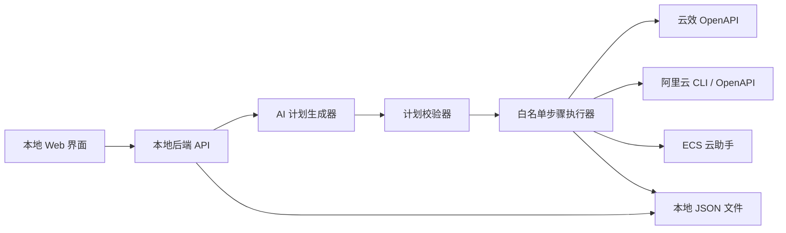

# 测试环境自动化工具方案

## 目标

本项目做一个本地自用的测试环境自动化工具。通过一个简单界面输入项目分组、项目名、项目类型、测试域名等信息，自动完成测试环境中重复度高的初始化工作。

本期只覆盖测试环境，不覆盖生产环境。

## 本期范围

### 要做

- 创建云效 Codeup 代码组。
- 创建云效空白代码仓库。
- 前端项目创建 OSS Bucket。
- 前端项目创建测试流水线：构建并上传静态产物到 OSS。
- 后端项目创建数据库。
- 后端项目创建 ACR 镜像仓库。
- 后端项目在测试 ECS 写入部署脚本。
- 后端项目在测试 ECS 写入 Nginx 配置。
- 后端项目创建测试流水线：构建镜像、推送 ACR、触发测试 ECS 拉取并部署。
- 所有项目和执行记录保存到本地文件。
- 利用大模型生成结构化执行计划、命名建议、流水线 YAML 和部署脚本草案。

### 不做

- 不做生产环境。
- 不引入 Redis、MQ、外部数据库。
- 测试环境暂时不接入 CDN。
- 不做复杂权限系统。
- 不做多人协作。
- 不做完整资源回收平台。

## 总体架构



核心原则：

- 大模型负责分析和生成计划，不直接执行命令。
- 后端只执行白名单步骤，避免大模型生成任意危险操作。
- 每一步都写日志，失败后可以从日志判断卡在哪一步。
- 资源创建尽量做成幂等：已存在则复用，不重复创建。

## 技术选型

推荐使用一个最小单体应用：

- 框架：Next.js。
- UI：React + 基础表单组件，先不引入复杂管理后台框架。
- 存储：本地 JSON 文件。
- 云资源调用：优先使用阿里云 CLI 和云效 OpenAPI。
- AI 调用：封装为 `planner`，输出固定 JSON schema。
- 执行模式：同步执行步骤并写入日志，暂不引入队列。

建议目录：

```text
aliyun-devops-tool/
  app/
    page.tsx
    projects/
      [id]/
        page.tsx
  src/
    ai/
      planner.ts
      schemas.ts
    config/
      local.json
    runner/
      runProject.ts
      steps/
        codeup.ts
        rds.ts
        oss.ts
        acr.ts
        flow.ts
        ecs.ts
        nginx.ts
    storage/
      projects.ts
      logs.ts
  data/
    projects.json
    runs/
  templates/
    frontend-pipeline.yml
    backend-pipeline.yml
    deploy.sh.hbs
    nginx.conf.hbs
```

## 页面设计

### 新建项目页

字段：

- 项目分组：例如 `mall`
- 项目名：例如 `order-web`
- 项目类型：`frontend` 或 `backend`
- 测试域名：例如 `order-test.example.com`
- 构建命令：可选，前端默认 `pnpm install && pnpm build`
- 构建产物目录：可选，前端默认 `dist`
- 后端服务端口：可选，后端默认由 AI 根据技术栈建议，也允许手动输入

按钮：

- 生成计划
- 执行计划

### 执行计划页

展示：

- 将创建的代码组路径。
- 将创建的仓库路径。
- 将创建的数据库名。
- 将创建的 OSS Bucket。
- 将创建的 ACR 仓库。
- 将写入的部署路径。
- 将写入的 Nginx 配置摘要。
- 将创建的云效流水线名称。
- 步骤列表和风险提示。

### 项目详情页

展示：

- 项目基本信息。
- 仓库地址。
- 流水线 ID。
- OSS Bucket。
- 数据库名。
- ACR 镜像地址。
- 测试域名。
- 执行日志。

## AI 使用方式

AI 不直接操作云资源。AI 的输入是用户表单和本地配置，输出是结构化执行计划。

示例输出：

```json
{
  "project": {
    "group": "mall",
    "name": "order-web",
    "type": "frontend",
    "domain": "order-test.example.com"
  },
  "resources": {
    "codeGroupPath": "mall",
    "repoPath": "order-web",
    "ossBucket": "test-mall-order-web",
    "database": null,
    "acrRepository": null
  },
  "steps": [
    {
      "type": "ensureCodeGroup",
      "params": {
        "path": "mall",
        "name": "mall"
      }
    },
    {
      "type": "ensureRepository",
      "params": {
        "groupPath": "mall",
        "repoPath": "order-web"
      }
    },
    {
      "type": "ensureOssBucket",
      "params": {
        "bucket": "test-mall-order-web"
      }
    },
    {
      "type": "createFrontendPipeline",
      "params": {
        "name": "order-web-test",
        "buildCommand": "pnpm install && pnpm build",
        "artifactDir": "dist"
      }
    }
  ]
}
```

执行前必须校验：

- `steps[].type` 必须属于白名单。
- 项目名、Bucket 名、数据库名、仓库路径必须符合命名规则。
- 域名必须属于允许的根域。
- 不能包含任意 shell 命令步骤。
- 部署脚本和 Nginx 配置只能由模板渲染，AI 只能给参数和建议。

## 白名单步骤

第一期允许的步骤：

- `ensureCodeGroup`
- `ensureRepository`
- `ensureOssBucket`
- `ensureDatabase`
- `ensureAcrRepository`
- `writeDeployScript`
- `writeNginxConfig`
- `reloadNginx`
- `createFrontendPipeline`
- `createBackendPipeline`

后续新增步骤必须先加入 schema 和执行器，不能让 AI 自由发明步骤。

## 前端项目流程

输入示例：

```json
{
  "group": "mall",
  "name": "order-web",
  "type": "frontend",
  "domain": "order-test.example.com",
  "buildCommand": "pnpm install && pnpm build",
  "artifactDir": "dist"
}
```

执行流程：

1. 校验输入。
2. AI 生成执行计划。
3. 校验执行计划。
4. 创建或复用 Codeup 代码组。
5. 创建或复用 Codeup 仓库。
6. 创建或复用 OSS Bucket。
7. 配置 OSS 静态网站托管。
8. 创建云效测试流水线：
   - 拉取代码。
   - 执行构建命令。
   - 上传构建产物到 OSS。
9. 保存项目记录和执行日志。

说明：

- 测试环境暂时不使用 CDN。
- HTTPS 暂不强制处理，避免拖慢 MVP。
- 如果必须使用自定义域名访问 OSS，需要再补 DNS CNAME 和 OSS 域名绑定能力。

## 后端项目流程

输入示例：

```json
{
  "group": "mall",
  "name": "order-api",
  "type": "backend",
  "domain": "order-api-test.example.com",
  "servicePort": 18080
}
```

执行流程：

1. 校验输入。
2. AI 生成执行计划。
3. 校验执行计划。
4. 创建或复用 Codeup 代码组。
5. 创建或复用 Codeup 仓库。
6. 在指定 RDS 实例创建或复用数据库。
7. 创建或复用 ACR 镜像仓库。
8. 通过 ECS 云助手在测试服务器创建应用目录：

```text
/opt/apps/order-api/
  deploy.sh
  docker-compose.yml
  .env
```

9. 写入 Nginx 配置：

```text
/etc/nginx/conf.d/order-api.conf
```

10. 执行 `nginx -t`。
11. `nginx -t` 成功后执行 `systemctl reload nginx`。
12. 创建云效测试流水线：
    - 拉取代码。
    - Docker build。
    - Push 到 ACR。
    - 通过 ECS 云助手执行 `/opt/apps/order-api/deploy.sh`。
13. 保存项目记录和执行日志。

## 本地配置

建议使用 `src/config/local.json` 或 `.env.local` 保存本地配置。

示例：

```json
{
  "aliyun": {
    "region": "cn-hangzhou",
    "profile": "default"
  },
  "yunxiao": {
    "domain": "https://devops.aliyun.com",
    "organizationId": "your-org-id",
    "tokenEnv": "YUNXIAO_TOKEN"
  },
  "rds": {
    "instanceId": "your-rds-instance-id",
    "defaultCharset": "utf8mb4"
  },
  "acr": {
    "instanceId": "your-acr-instance-id",
    "namespace": "test"
  },
  "ecs": {
    "testInstanceId": "your-test-ecs-instance-id",
    "appRoot": "/opt/apps",
    "nginxConfDir": "/etc/nginx/conf.d"
  },
  "domain": {
    "allowedRoot": "example.com"
  }
}
```

敏感信息不要写入仓库：

- 阿里云 AccessKey。
- 云效个人访问令牌。
- 数据库账号密码。
- ACR 登录密码。

这些值优先从环境变量读取。

## 本地数据结构

`data/projects.json`：

```json
[
  {
    "id": "20260429-mall-order-web",
    "group": "mall",
    "name": "order-web",
    "type": "frontend",
    "domain": "order-test.example.com",
    "status": "created",
    "resources": {
      "repoUrl": "https://codeup.aliyun.com/example/order-web.git",
      "ossBucket": "test-mall-order-web",
      "pipelineId": "12345"
    },
    "createdAt": "2026-04-29T15:30:00+08:00",
    "updatedAt": "2026-04-29T15:35:00+08:00"
  }
]
```

`data/runs/{runId}.jsonl`：

```jsonl
{"time":"2026-04-29T15:31:00+08:00","level":"info","step":"ensureCodeGroup","message":"start"}
{"time":"2026-04-29T15:31:02+08:00","level":"info","step":"ensureCodeGroup","message":"group exists, reuse"}
{"time":"2026-04-29T15:31:03+08:00","level":"info","step":"ensureRepository","message":"created repository"}
```

## 命名规则

建议统一命名，降低后续维护成本。

- 代码组：`{group}`
- 仓库：`{projectName}`
- 前端 OSS Bucket：`test-{group}-{projectName}`
- 数据库：`test_{group}_{projectName}`，将 `-` 转换为 `_`
- ACR 仓库：`{group}/{projectName}`
- 流水线：`{projectName}-test`
- ECS 应用目录：`/opt/apps/{projectName}`
- Nginx 配置：`/etc/nginx/conf.d/{projectName}.conf`

命名限制：

- 项目名只允许小写字母、数字、短横线。
- 数据库名只允许小写字母、数字、下划线。
- Bucket 名必须全局唯一，必要时可追加短 hash。
- 域名必须属于配置中的根域。

## 错误处理

每个步骤返回统一结果：

```json
{
  "step": "ensureRepository",
  "status": "success",
  "resourceId": "12345",
  "message": "repository created"
}
```

失败结果：

```json
{
  "step": "ensureRepository",
  "status": "failed",
  "errorCode": "YUNXIAO_FORBIDDEN",
  "message": "token has no repository write permission"
}
```

失败后策略：

- 默认停止后续步骤。
- 已创建资源先不自动删除，避免误删。
- 后续通过幂等逻辑重跑。
- 页面展示失败步骤和原始错误摘要。

## MVP 实现顺序

### 第一阶段：前端项目闭环

目标：输入前端项目信息后，可以创建仓库、OSS Bucket 和前端测试流水线。

任务：

1. 搭建 Next.js 项目。
2. 实现本地配置读取。
3. 实现本地 JSON 存储。
4. 实现新建项目表单。
5. 实现 AI 计划生成和 schema 校验。
6. 实现 Codeup 代码组和仓库步骤。
7. 实现 OSS Bucket 步骤。
8. 实现前端流水线 YAML 生成和创建。
9. 实现执行日志页面。

### 第二阶段：后端项目闭环

目标：输入后端项目信息后，可以创建仓库、数据库、ACR 仓库、测试服务器部署脚本、Nginx 配置和后端流水线。

任务：

1. 实现 RDS 数据库步骤。
2. 实现 ACR 仓库步骤。
3. 实现 ECS 云助手执行步骤。
4. 实现部署脚本模板。
5. 实现 Nginx 配置模板。
6. 实现后端流水线 YAML 生成和创建。
7. 增加 `nginx -t` 校验和 reload。

### 第三阶段：可用性增强

目标：减少失败成本，提高日常使用效率。

任务：

1. 增加资源存在性检查。
2. 增加失败重试。
3. 增加项目详情页。
4. 增加执行计划 diff。
5. 增加导入已有项目。
6. 增加配置检查页。

## 验收标准

前端项目 MVP 验收：

- 可以通过页面输入项目信息。
- 可以生成可读的执行计划。
- 可以创建或复用云效代码组。
- 可以创建云效仓库。
- 可以创建 OSS Bucket。
- 可以创建云效前端测试流水线。
- 可以在本地文件看到项目记录和执行日志。

后端项目 MVP 验收：

- 可以创建或复用云效代码组。
- 可以创建云效仓库。
- 可以创建数据库。
- 可以创建 ACR 仓库。
- 可以在测试 ECS 写入部署脚本。
- 可以在测试 ECS 写入 Nginx 配置。
- 可以通过 `nginx -t` 后 reload。
- 可以创建云效后端测试流水线。
- 可以在本地文件看到项目记录和执行日志。

## 重要约束

- 不允许 AI 直接输出任意命令并执行。
- 不允许页面传入任意 shell 并执行。
- 不允许自动删除云资源。
- 不允许将密钥写入本地项目记录。
- 不允许跳过执行日志。
- 不允许生产环境逻辑混入本期 MVP。

## 后续可能扩展

- 支持生产环境审批。
- 支持 CDN 和 HTTPS。
- 支持更多技术栈模板。
- 支持资源回收。
- 支持接入 Terraform 或 ROS。
- 支持多人使用和登录权限。
- 支持任务后台执行和通知。
